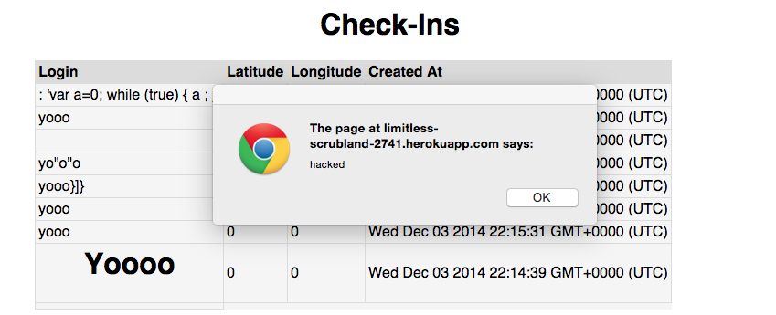
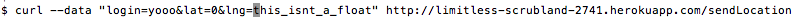
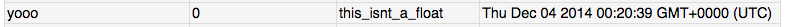
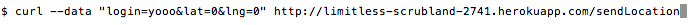

# Security Report for Marauder's Map & Where in the World

By Ben Tanen

* * *

### Introduction

The products being tested are Simon Warchol's Marauder's Map and WhereInTheWorld assignments for COMP-20 (F14). 

The goal/purpose of the Marauder's Map was to send the user's geolocation to a server and handle the returned data. This returned data was a collection of up to 100 logins and associated locations. These locations would then be mapped on a map (using Google Maps).

The goal/purpose of the WhereInTheWorld assignment was to make the back-end server that was ultimately used by the Marauder's Map. It was to have multiple APIs including: users could send their login & location and be returned the previously stored data, users could search for a specific login and view any of it's associated data, users could view all of the data on the root page, users could be passed the data from the MBTA's redline.json.

My purpose, as a security tester, is to test the two applications and discover any vulnerabilities in their implementation. For the purpose of this report, vulnerabilities included gaps in security that have potential to lead to application failure (the extent of this failure is described below). The following report outlines such vulnerabilities and potential solutions to resolve these issues.

### Methodology

The assessment of these applications was broken down into two parts: "black-box" assessment and source code review. In order to test the actual vulnerabilities, the command-line tool `curl` was used to send various data to the `/sendLocations` API of the WhereInTheWorld application. The handling of this data led to the issues described.

### Abstract of Findings

After testing the two applications, it appears the apparent security issues are related to a lack of data validation throughout both applications. Most of the user data throughout both applications were not validated to check for proper input, since there was an inappropriate amount of faith in the user and their inputs. Because of this, with knowledge of these security gaps, hackers have the potential to cause major damage to these two applications.

The first issue, and a major issue in many websites, was the potential for cross-site scripting. This leaves open the possibility for users to inject unauthorized code to tamper with the operation of the application. Additionally, through the use of tools like `curl` and [Tamper Data](https://addons.mozilla.org/en-US/firefox/addon/tamper-data/) for Firefox, users are able to forge their geolocation data, ultimately inputting false information into the database. Another issue was the lack of validation in the Marauder's Map's data, leaving the possibility for the client-side JavaScript to fail due to invalid data/data-types. Finally, another validation error lies in the `/locations.json` API where users have the possibility to pull the location data of everyone, even though users are meant to only get filtered data for a specific login from this API.

For more information on these vulnerabilities, see below.

### Issues Found

These issues are listed in order of their importance / severity.

**Cross-Site Scripting** (SEVERE): The first major issue found was the potential for cross-site scripting (including JavaScript injection). This issue was found in the `/sendLocation` API of assignment #3. The user is suppose to input a login, latitude and longitude view a HTTP POST request, and upon successful submission of data (either via `curl` or the Marauder's Map), the user is returned all of the previously submitted data from the Mongo DB. The security issue arises because the API does not check the contents of the login/latitude/longitude data. Because of this, it is possible to insert small (or large) client-side scripts, like the JavaScript seen here:

By using tools like `curl` or Tamper Data, scripts can be sent into the database that can cause an array of issues with the applications, including the example below. *Note:* the header style "yooo" seen below is another example of invalid data that could be sent (`<h1>Yooo</h1>`) that isn't quite XSS.

Because of the many possibilities of client-side scripts and the creativity hackers, cross-site scripting can be a major issue that should be resolved **ASAP**. A possible way to resolve this issue (at least in terms of this assignment) is to filter out any data that includes signs of XSS (like the JS `<script>` tag). An example for how that might be done (using regular expressions) includes: `var login = (request.body.lat).replace(/<script>.*<\/script>/g, '')`. By using this sort of trimming/replacing for user data, the possibility for XSS is drastically minimized.

**Query All Location Data with Request Injection Attack** (SEVERE): Another severe security vulnerability is the request injection attacks possible through MongoDB and the `/locations.json` API. The purpose of this API is to return the data associated with a specific login in JSON format. If a valid login is provided via an HTTP GET request, the data is returned. If an invalid login (or no login) is provided, a blank array is returned. For security purposes, this could be so that a specific user can only view their own location data and no one else's. However, by using request injection attacks via MongoDB, it is possible to obtain all of the location data by bypassing the login validation. In this specific application, there are a few ways to perform these attacks, and they include the following examples (and the data that is returned):

    [app_url]/locations.json?login[$ne]=yooo // return all data with logins NOT EQUAL to yooo
    [app_url]/locations.json?login[$regex]=.* // return all data matching the regular expression for everything
    [app_url]/locations.json?login[$gt]= // return all data greater than 'void'

Any of these expressions / queries will return all of the data stored (except for data with 'yooo' and/or 'void' as the login) which is very much beyond the intended scope of what the user should be capable of. Whereas the user is only suppose to get a single login's data (or nothing), a user could get all of the data, potentially revealing private data not intended for the user. Obviously, because of the potential danger behind this sort of attack, it is a severe vulnerability that should be fixed **ASAP**.

The best way to combat this type of attack is to (again) validate the type and contents of the data that is being sent to the database. In this case, a simple way to validate the contents is to cast these requests to strings, therefore limiting their potential for attack. Example code would be:

    // change 1st line (current code) to 2nd line
    var login = request.body.login;
    var login = String(request.body.login);

If the code were to be swapped and a user were to attempt a request injection attack, the request would simply search for the string '[object Object]' which would return nothing (unless a login was for some reason actually '[object Object]').

**Invalid Location Data Types for Marauder's Map** (MODERATE): Again similar to the XSS issue above, this vulnerability in assignment #2 requires data validation. Once the user sends their location data, they will in turn receive the previously submitted data from the database. From here, the assignment is set up to place markers at all of these positions, where the positions are in floats describing the latitude and longitude. This operation would obviously run into issues if the location data is not actually in float / number form, such as a string. However, there is no validation to make sure that floats are passed to assignment #2 / the marker placing function, and this is where the security issue arises.

Again using tools like `curl`, I was able to pass location data that was non-float successfully and see it stored in the database (see above images). This shows that these non-float data points are in the database and would then be passed to assignment #2, causing failure when it attempts to place a pin at "this\_isnt\_a\_float".

There are a few approaches available to prevent this. First of all, like the above issues, data validation through the `/sendLocation` API could check if the location data is in fact numeric. If it isn't, the server simply wouldn't store the data. Another solution is on the client-side end of assignment #2 where a pin is only placed for data with float location points. Example code that would do this includes:

    function addStudentMarker(stu_login,stu_lat,stu_lng,stu_time) {
        if ( IsNumeric(stu_lat) && IsNumeric(stu_lng) ) {
            marker = new google.maps.Marker({
                position: {lat: stu_lat, lng: stu_lng},
                map: map
            });

            // continue handling marker
            // ...
        } else {
            // return with no marker
            // ...
        }
    }

**Sending Invalid / Unverified Data via Curl** (MODERATE): Similar to the previous vulnerabilities, this issue is again based on unchecked invalid/unverified data found in `/sendLocation`. One of the main purposes of assignment #2 was to obtain and send the user's actual geolocation to the server. However, because of the capabilities of tools like `curl`, Data Tamper and the lack of data validation in these applications, users have the ability to send in invalid location data, creating an inaccurate map for assignment #2. An example `curl` command that submits invalid data is included. As you can see, when the data is represented on the map in assignment #2, it has the user "yooo" off the coast Ghana, where the user was clearly not (it was actually sent from Tufts).

While this issue does not cause any direct damage to the application as a whole, it allows users to take control in a way that is not intended for the application. The Marauder's Map is suppose to take the user's actual location so that should be the only possibility.

To validate that the locations that are being received by the server are valid, the server could run an additional check to cross reference the locations with the IP address of sender. By using Express' `req.ip` and geolocation software like [Geolite](http://dev.maxmind.com/geoip/legacy/geolite/), the user's location can be verified within a band of certainty. Exact implementation would vary from implementation to implementation, but the code would work somewhat like:

    Store provided location (`lat`, `lng`) and IP (`req.ip`)
    Use Geolite (or similar tool) to convert IP to geolocation (coordinate)
    Verify that IP-converted geolocation is within a certain distance of provided location (distance can vary)
    If locations are valid, store data in DB
    If locations are invalid, reject data

* * *

### Conclusion
You can also list future considerations and recommendations with costs.